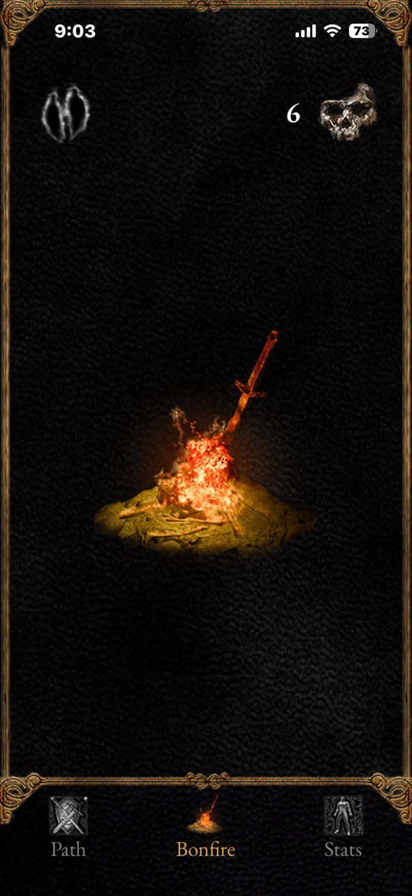
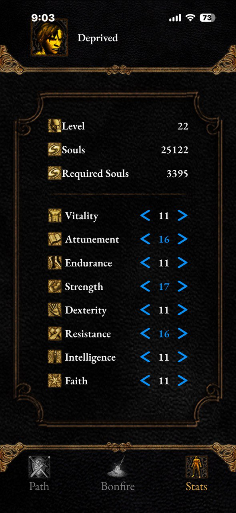
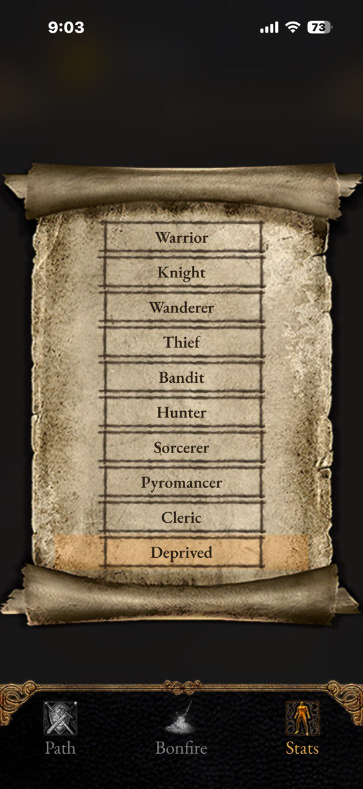
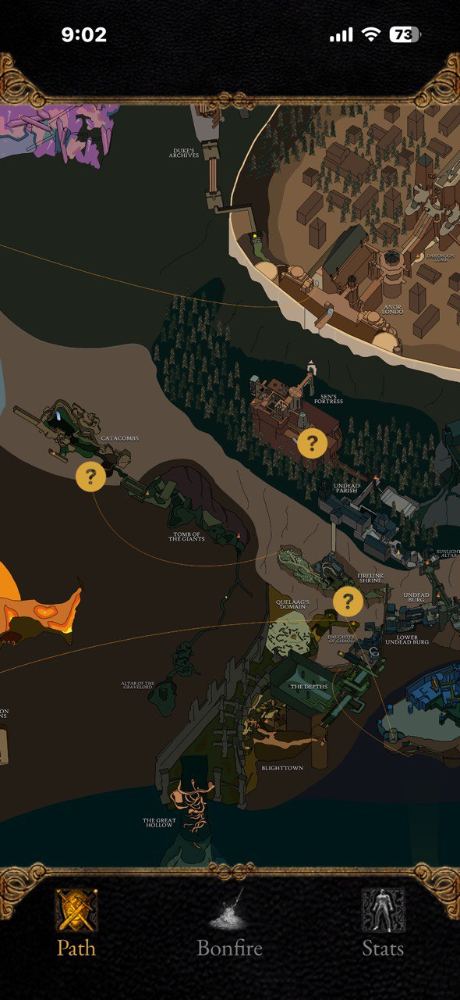
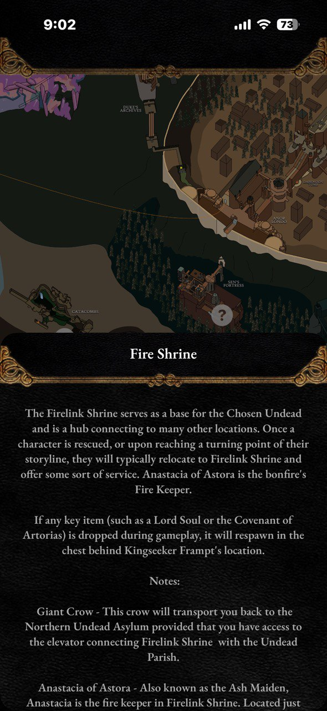

# DarkSouls-Helper

Dark Souls Helper - project that consists of two solutions.
Status: Abandoned / Work-in-progress (no longer maintained).

## 1. Overlay for Dark Souls: Remastered. 

This program displays:

- the player's death count;
- the player's death count from a specific boss (or just from mobs);
- the player's current location;
- the player's name;
- the server status (currently cannot be optional);

> The ****"server status"**** is required for the WebSocket connection with the second solution.

     

## 2. iOS app.

This app have two modes: ****offline**** and ****online****. In ****offline**** mode, you can use a stats calculator to see how many souls are needed for a specific level and view the Dark Souls map. In ****online**** mode, you receive data from the overlay app, including synced death counts (overall and from bosses), your location (with lore available on the map), and your character stats.

  
  
  

  
  

  
